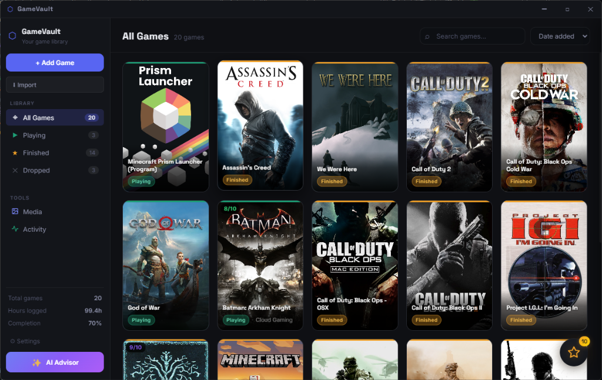

<div align="center">
  
  <h1>GameVault</h1>
  <p><strong>A modern, privacy-first personal game library manager, launcher, and playtime tracker.</strong></p>

  <p>
    <a href="https://github.com"></a>
    
    
    
  </p>

  <br />
  
  <br /><br />
</div>

---

## ✨ Features

- **🎮 Unified Game Library**: Organize and launch all your games from one centralized vault — Steam, Epic Games, GOG, standalone executables, and emulated titles.
- **🔍 Multi-Platform Library Scanner**: One-click detection for installed Steam and Epic Games titles, custom directory scanning, and deep filesystem heuristics.
- **⏱️ Automated Playtime Tracking**: Background process monitor detects game launches automatically and logs play sessions down to the minute with 30-day activity breakdowns.
- **🤖 Hardware-Aware AI Advisor**: Bring your own API key (*OpenAI, Anthropic Claude, Google Gemini, DeepSeek, or custom endpoints*) for personalized recommendations and hardware performance estimation based on your CPU and GPU.
- **🖼️ SteamGridDB Cover Art**: Automatic high-resolution 600×900 vertical covers and ultra-wide hero banner art integration.
- **🎨 Custom Theming & Dynamic Grid**: Built-in curated themes (*Midnight, Cyberpunk, Crimson, Monochrome, Ocean, AMOLED, Sunset*) plus a full custom theme builder and configurable Cards-per-Row scaling (4 to 12 columns).
- **⚡ In-Game Overlay & Media Capture**: Access your library and game advisor in-game via global hotkey (`Shift+Alt+G`) with built-in screenshot and clip capture.

---

## 🚀 Getting Started

### Prerequisites
- [Node.js](https://nodejs.org/) (v18 or higher recommended)
- [npm](https://www.npmjs.com/)

### Installation

1. **Clone the repository:**
   ```bash
   git clone https://github.com/your-username/gamevault.git
   cd gamevault
   ```

2. **Install dependencies:**
   ```bash
   npm install
   ```

3. **Launch the application:**
   ```bash
   npm start
   ```

---

## 📦 Building Executables

GameVault is packaged using `electron-builder`:

- **Windows NSIS Installer (`.exe`):**
  ```bash
  npm run build
  ```

- **Portable Executable (`.exe`):**
  ```bash
  npm run build:portable
  ```

Build artifacts are generated directly in the `dist/` directory.

---

## ⚙️ Configuration & Optional Integrations

GameVault works completely offline and stores your library locally. To enable extended artwork and AI features, configure your free API keys in **Settings > Integrations**:

| Provider | Purpose | Link |
| :--- | :--- | :--- |
| **SteamGridDB** | High-res game posters and hero banners | [steamgriddb.com/api](https://www.steamgriddb.com/profile/preferences/api) |
| **OpenAI / Claude / Gemini / DeepSeek** | Hardware performance estimation & AI advisor | Configure in Settings |

### Local Data Storage
All library data and preferences are saved locally on your device:
```
%APPDATA%\gamevault\
├── games.json
├── config.json
└── profile.json
```

---

## 📄 License

This project is licensed under the **MIT License** — see the [LICENSE](LICENSE) file for details.
